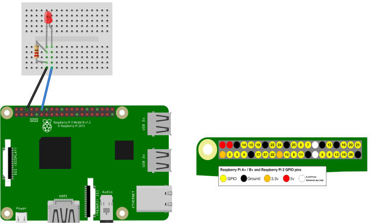
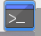
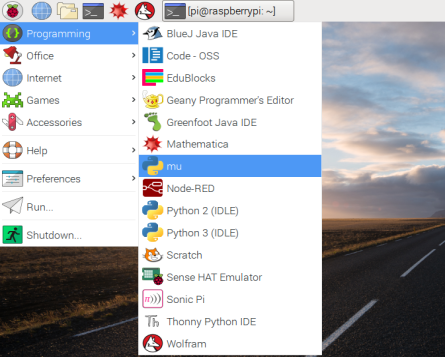
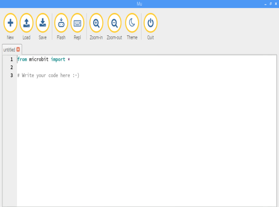
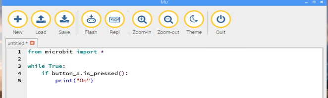
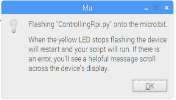
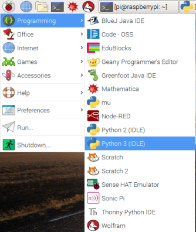
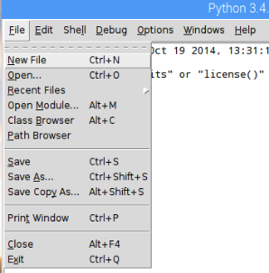
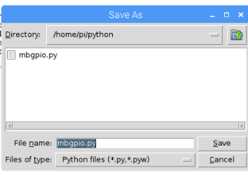

# Controlling Raspberry Pi GPIO with Micro:bit

The micro:bit is programmed through a USB port, because of this we can use serial commands to interface between the micro:bit and Raspberry Pi using Python 3. The Python library we will be using is called Serial.

## Building The Circuit


## Installing The Software
We need to first install the Python serial library on our Raspberry Pi, go to the Raspberry Pi terminal by clicking on the  Icon in the top left hand corner and type the following command:

```
sudo pip3 install pyserial
```

Next we need to install the Mu micro python editor. This is what we use to write code for the micro:bit. To install mu type the following command:

```
sudo apt install mu -y
```

Once the installer has finished close the terminal window to get back to the desktop.

## Programming The micro:bit
The first thing we need to do is load up mu. Go to the Raspberry Pi menu -> Programming and click on mu 

Once mu is opened you should see something like this: 

In the mu editor type the following code:

```Python
from microbit import *

while True:
  if button_a.is_pressed():
    print("on")
```
Here is what is should look like: 

### What the code does
* **Line 1** will import the micro:bit library to control the micro:bit buttons.

* **Line 2** will create a while true loop. This is the same as the forever loop in Scratch.

* **Line 3** will check to see if the button has been pressed.

* **Line 4** will print the word "On" to the serial interface for us to use later..

## Uploading The Code
Connect the USB lead between the micro:bit and Raspberry Pi. Once this is done we can upload the code. This is done by clicking on the "FLASH" button in mu: 

Once you click flash you should see something like this: 

<div class="page-break"></div>

## Coding The Raspberry Pi
Now we need to code our Raspberry Pi. Start by going to the Raspberry Pi menu -> Programming and click on Python 3 (IDLE): 

Once Python 3 has opened up, you will see the shell. in the top menu click on File -> New File:  This will open up a new file for us to type our code into.

Type the following code:

```Python
import serial, time
from gpiozero import LED

port = "/dev/ttyACM0"
baud = 115200
led = LED(18)

while True:
  s = serial.Serial(port)
  s.baudrate = baud
  data = s.readline()
  data = str (data)
  if "On" in data:
    led.on()
    print("On")
```

Now save your code. press CTRL+S on your keyboard. Name the file **mbgpio.py** and save it in the Python folder: 

## Running The Code
Make sure the micro:bit is connected to the Raspberry Pi and now press F5 on your keyboard. Your code should now run.

Well done you have just controlled an LED with a micro:bit and Raspberry Pi.
