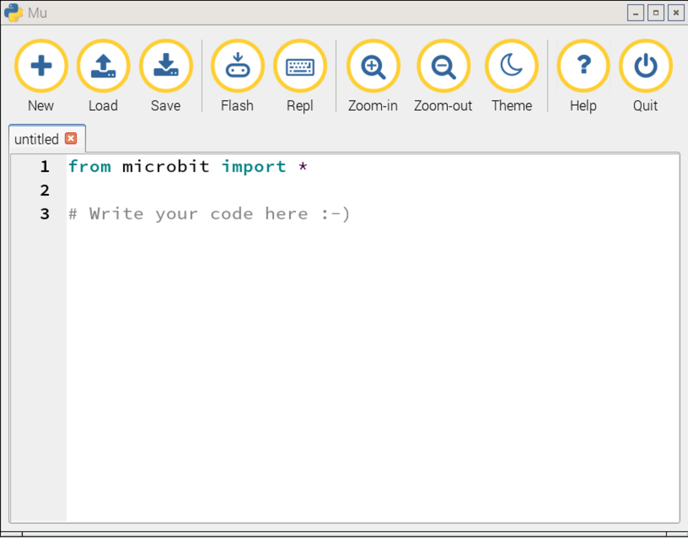

## Starting mu

MicroPython is a small but very fast version of Python 3 that has been specially designed to work on microcontrollers, such as those found on the micro:bit. To start writing MicroPython code on your Raspberry Pi, it's helpful to have an IDE (Integrated Development Environment), to make things a little easier for you. Luckily, **[mu](https://github.com/ntoll/mu)** is an open-source editor designed especially for children, and can run on your Raspberry Pi.

- Open `Mu` from the main menu under `Programming`.

- A new window should open up that looks like this:

	

