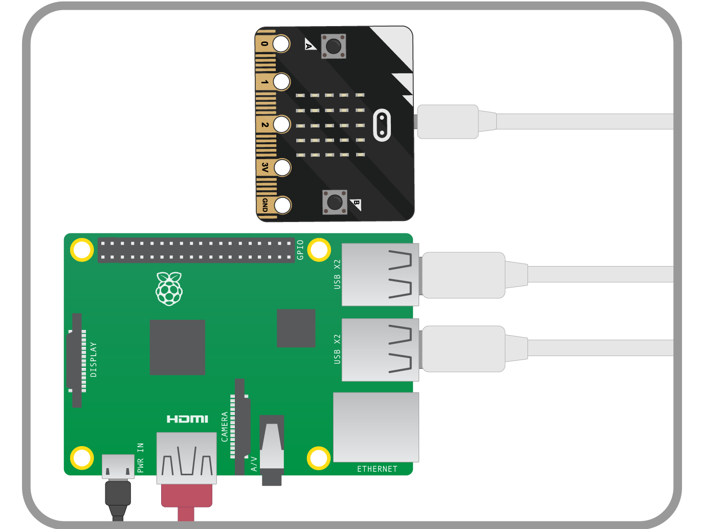

## Plugging in your micro:bit

The micro:bit has a micro USB port that you can use to connect it to your Raspberry Pi. This will provide a power *and* data connection.

- Connect your Raspberry Pi to the micro:bit using a USB A-to-micro-B cable, as shown below:

	

- You'll know that the micro:bit has connected to your Raspberry Pi, because a dialogue box should pop up like the one below:

	

- This dialogue box might pop up a few times while you're playing with the micro:bit. You can simply click on `Cancel` when it does.

