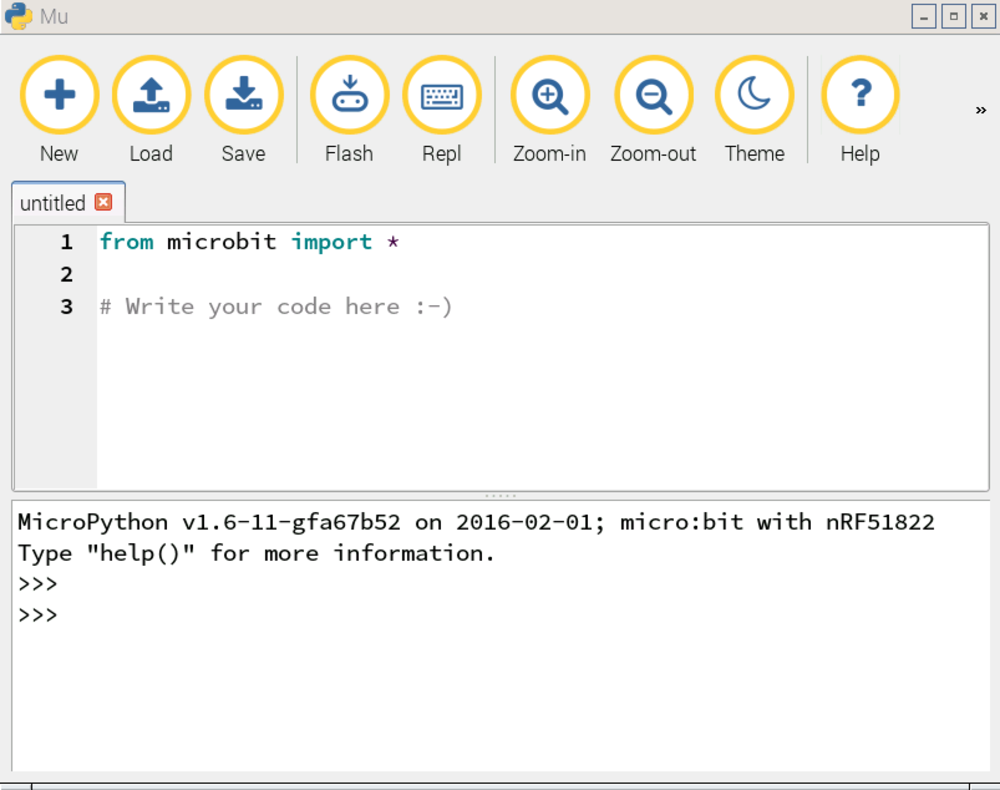

## Using the REPL

The *REPL* is an interactive shell, running on the micro:bit itself. Here you can write code and instantly see it running on your micro:bit.

- Click on the `Repl` button and wait for the interactive shell at the bottom to open up:

	

- You can click into the *REPL* and start writing your code straight away. Try the following two lines:

  ```python
  from microbit import *
  display.scroll('Woop, woop')
  ```

- Did you see the text scrolling across the LED matrix of the micro:bit? If not, you can type the second line again to scroll the message a second time:

  ```python
  display.scroll('Woop, woop')
  ```

- The *REPL* is a great place to write single lines of code to test them out, but for larger scripts, you'll need to use files.

