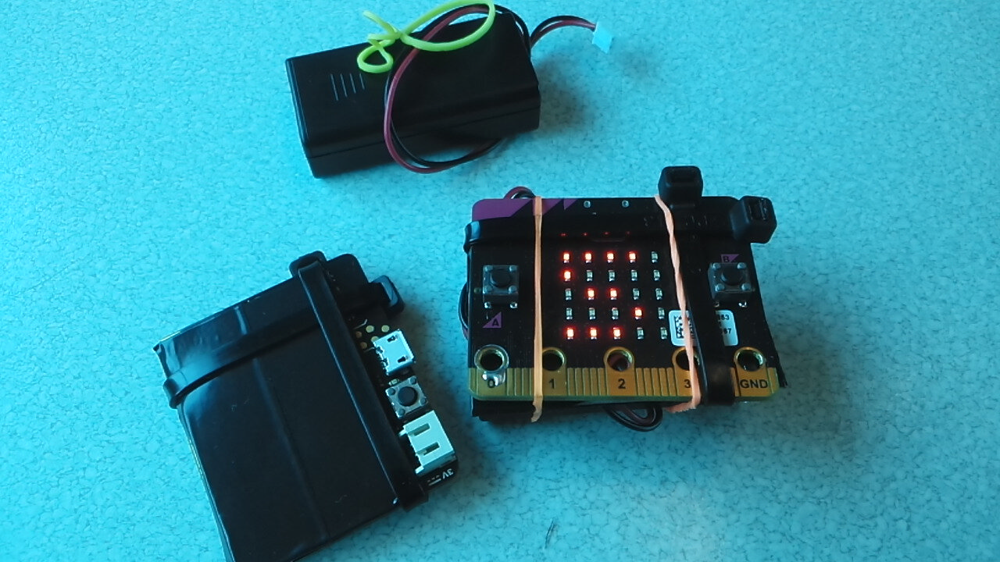

# Microbit: Marco Polo
by Cathal Garvey, Copyright 2017, Released under GNU AGPLv3 or later

This is a little Marco-Polo game I made for the BBC Microbit, as a toy for
my kids. It uses two or more Microbits, equipped with speakers or peizos, and
the object of the game is to use one of the microbits to find other hidden
ones using a limited number of prompts, delivered by radio.

## Setup
Equip each Microbit with a Piezo on Pin 3, in the usual way. I soldered mine
on and gave the Peizos a little sounding board each, then wrapped the peizo/board
in electrical tape to prevent shorts. The peizo is then ziptied to the Microbit,
and I used small elastics to keep the battery packs attached.

## Flashing
I like to use [uflash][uflash] to flash this program on, usage is simply
`uflash main.py` when a Microbit is connected. Works well on Ubuntu/Linux, at
least. This should also compile to a hex file successfully if you just paste
it into a browser compiler.

## Usage
Any device can send "Marco" prompts by pressing "A".

When a device has used up its number of "Polo" responses, pressing its "B"
button will refresh it.

According to the parameters in the `main.py` file, the devices will have a
certain number of "Polo" responses to each "Marco" another Microbit makes. The
default is 5. The "Polo" sound is a simple siren, which can be configured to
be faster or shorter by adjusting the `steps` parameter, and which either climbs
and then falls, or only climbs, according to another parameter.

Finally, there is a "Debouncing" parameter that helps prevent "Polo" responses
from being consumed too quickly, and the brightness on any device in "Debounce"
mode will be reduced to make that obvious.

That's it! Use it for treasure hunts, or blindfolded Marco-Polo, or whatever.

## Improvements
Improvements are very welcome!
If you're able to code (or willing to learn, in the spirit of Micro:bit), then
please contribute. If you're unable or unwilling to do the coding, I'm still
open to suggestions; open an issue.

#### Recharging Responses
Perhaps it would be more fun if the available Responses started out smaller,
but increased over time to a configurable maximum? This might help enable longer
games of blindfolded Marco Polo, or it might permit more ambitious treasure-hunts
with more people sending out "Marco" prompts.

#### More Than 5 Responses
The Images for digits are in a static list, and don't go higher than 5.
More images could bring this to 9, or higher if the digits get cramped a little.
Improvements here are welcome, but using `microbit.display.scroll` isn't a
good solution; I started out that way and found the delay was an unacceptable
drag on the flow of the program.

[uflash]: https://pypi.python.org/pypi/uflash
