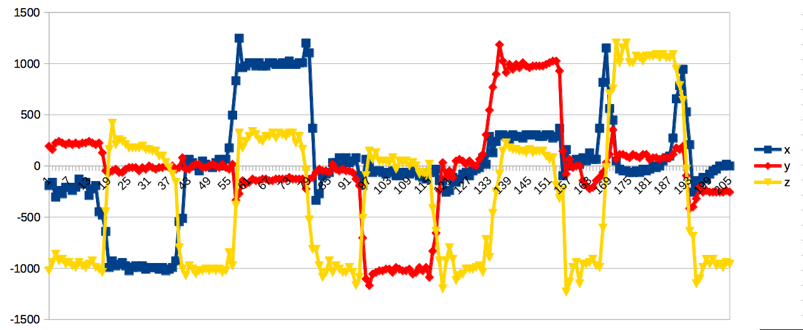

# mb_acc

Get micro:bit accelerometer data

# Requirements

Python 2

A micro:bit

Micro Python

A charting program that understands CSV files

# Setup

Press CLONE OR DOWNLOAD and then DOWNLOAD ZIP.

Unzip the zip file

Open python.microbit.org

Drag hex_files/acc.py into the editor

Press the DOWNLOAD button to get a hex file

Drag and drop this hex file onto your micro:bit

# Running the code

run the test.py program on PC/Mac using Python 2 
(might work on Python 3, not tested though)

Follow the instructions when asked to 'remove' and then 'connect' your
micro:bit - this detects which communications port it is plugged into on
your computer.

Note, if you use a different USB port later, delete the file portscan.cache
and it will force it to re-detect.

When the program runs, it creates a file 'log.csv' and appends x,y,z accelerometer
data 10 times a second. It also displays this on the console screen.

Move your micro:bit in the x,y and z planes.

When you have finished, CTRL-C or stop the python program.

# Analysing the data

Import log.csv into a spreadsheet program or other charting program that
can import and chart CSV files.

# Errors?

We've done some work recently to improve the error handling with the
pyserial library. It seems that some pre-installed pyserial packages
on some distributions have a subtly different API. Thanks to Andy
for helping me debug this on his Linux Mint 18/python 2.7.11 setup

In particular, pyserial 3.0.1 has this bug in it, but pyserial 3.2.1
has the bug fixed. So, if you are using a pre-installed pyserial
of around the 3.0.1 era, it's API is broken, and you should really
update it to the latest version.

