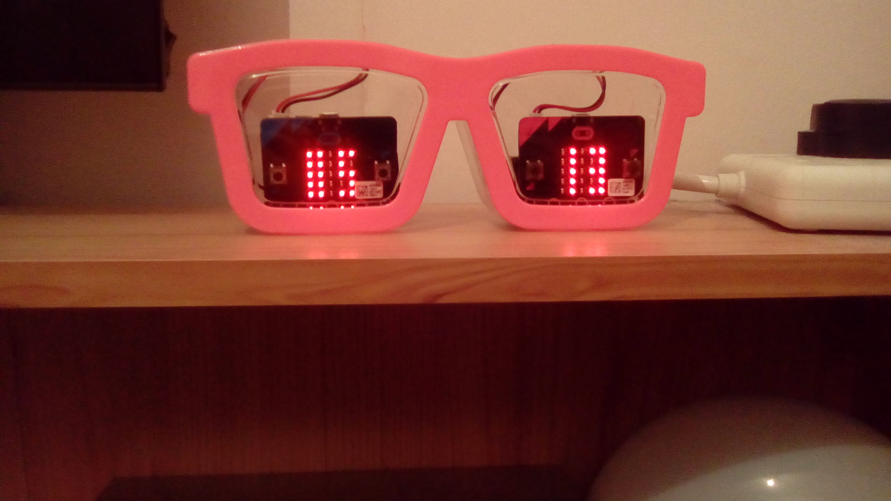

# mb_clock
A micro:bit clock

The font used inside clock.py has been nicknamed 'WhaleySans'.

It is a 2x5 font, digits 0-9 only, for the 5x5 micro:bit display.

This project is definitely: Work in progress.

David Whale

@whaleygeek

June 2017

