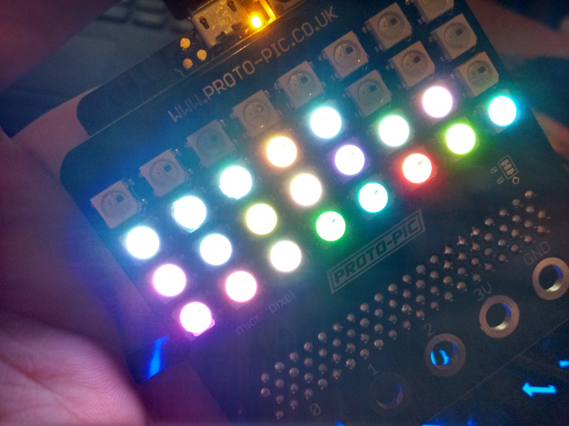

# Microbit Fluid Simulation

## General

This is an extremely simple fluid simulation for the micro:bit. The input is
the accelerometer included in the board, and the output is the LED matrix.

https://github.com/AntonioND/microbit-fluid

I've used python and Mu editor to develop this demo. This editor can be found in
the following links:

http://codewith.mu/

https://github.com/mu-editor/mu

The code of the regular demo is in `fluid.py`.

There's also a version for the "micro:pixel 4x8 NeoPixel board for BBC
micro:bit" (PPMB00100) in `fluid_rgb.py`.

## Video

https://www.youtube.com/watch?v=_u8xiFlvgcs

## Photos

## License

    Copyright (C) 2016 Antonio Niño Díaz

    This software may be modified and distributed under the terms
    of the MIT license.  See the LICENSE file for details.

## Contact

Email: antonio_nd@outlook.com
