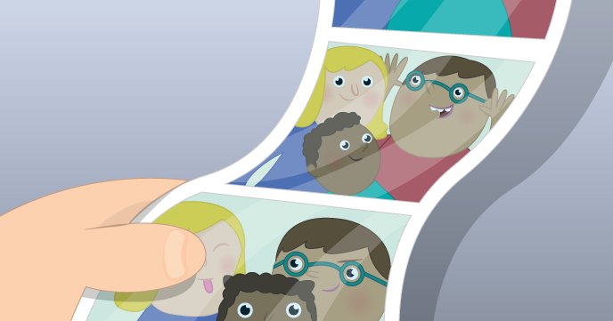

# micro:bit selfies

In this resource, you will make a micro:bit-controlled selfie booth with a Raspberry Pi and camera module, using Python. This is a great way to get started with hardware and simple text programming. 

## Licence

Unless otherwise specified, everything in this repository is covered by the following licence:

***micro:bit selfies*** by the [Raspberry Pi Foundation](http://www.raspberrypi.org) is licenced under a [Creative Commons Attribution 4.0 International License](http://creativecommons.org/licenses/by-sa/4.0/).

Based on a work at https://github.com/raspberrypilearning/microbit-selfies
