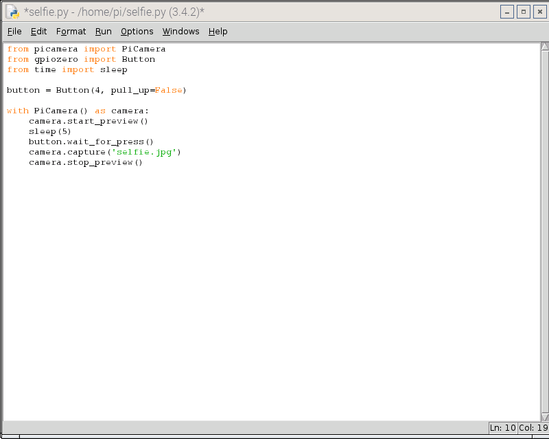
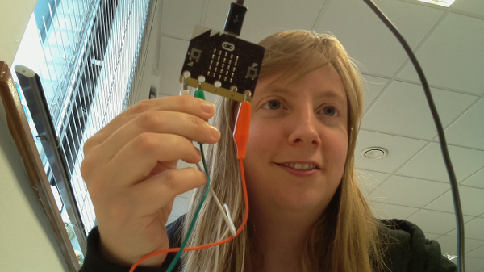

## Program the Raspberry Pi camera

- Locate and open Python 3 (IDLE) from the main menu by clicking on Programming. This is where you will write your Python code for the camera.
- Create a new file and save it as `microbit-camera.py`.
- Begin by importing all the libraries and modules required in this program by typing the following:

	```python
	from picamera import PiCamera
	from gpiozero import Button
	from time import sleep
	```
	
- Next, you need to tell the computer which pin is going to be used to trigger the camera to take a picture. You connected the microbit to GPIO pin 4. Underneath the imports, type:

	```python
	button = Button(4, pull_up = False)
	```

- Then write the sequence of instructions to take a picture when triggered by someone touching the micro:bit cable. First, show a preview from the camera by typing:

	```python
	with PiCamera() as camera:
	    camera.start_preview()
	    sleep(5)
	```

    Whilst the preview shows, you can get into position for your selfie. 
    
- Underneath, type the instruction to wait for the micro:bit trigger:

	```python
	    button.wait_for_press()
	    camera.capture('selfie.jpg`)
	    camera.stop_preview()
	```
	
	The program will wait for the trigger from the micro:bit, then take a picture and store it in a file called `selfie.jpg` before stopping the camera preview. 
	
	

- Save your file. Check that your micro:bit trigger is working, before clicking on **Run** and **Run Module** to start the camera code. 

	

